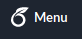

## Objectives

- Solve a set of given problems on Linked Lists.
- Use Psuedocode to solve implementation problems.
- Analyze time complexity for some methods.

## Deadline

**Thursday 16/4/2020 11:59pm PST**.

## Registration Link

* Go to the [assignment page](https://classroom.github.com/a/-DHJadxo) and git clone your own repository.

## Problem Set

* You should find the report requirements in the `README.md` file of your repository.
* You can solve the problems directly in the Markdown file `README.md`.
* Alternatively, you can solve the problems in the LaTeX template file `report.tex`, which warrants you a 10% bonus of your actual grade.
* Additionally, solving all problems correctly using LaTeX warrants you a GitHub sticker. 

### Instructions on using overleaf online XeLaTeX compiler

In order to use LaTeX in your machine it may require you to install around 1 GB of packages using `apt` installer. Alternatively, you can open your LaTeX document on the cloud using Overleaf services.

1. Sign-up at [overleaf.com](https://www.overleaf.com/).
2. In the [account settings](https://www.overleaf.com/user/settings) page, link your overleaf.com account to your GitHub account.
3. Go to your [dashboard](https://www.overleaf.com/project) page at overleaf.com then press "new project"   and select "Import from GitHub".
4. You should find your report repository starting with `sbe201-2020-report-1-*`.
5. After your project is imported, press   in the left upper corner, then under the "Setting" section select for the "Compiler": "XeLaTeX".
6. Finally, you can now edit the document properly and compile on-the-fly. After finishing you can push the changes back to the repository from   > "GitHub" >   to write a commit message then push.

### Useful links to learn basic LaTeX syntax

- [Learn LaTeX in 30 minutes - Overleaf](https://www.overleaf.com/learn/latex/Learn_LaTeX_in_30_minutes)
- [A simple guide to LaTeX - Step by Step](https://www.latex-tutorial.com)
- [The Bates LaTeX Manual](https://www.bates.edu/mathematics/resources/latex-manual/)
