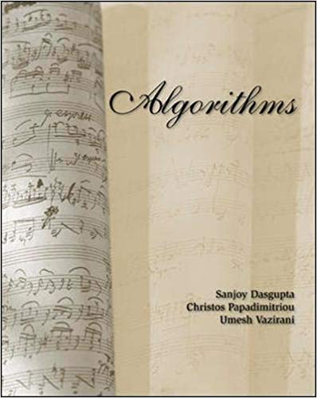
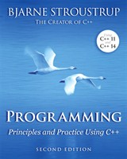
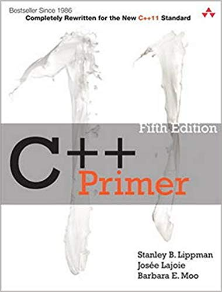

# Data Structures \(SBE201\) - Spring 2020

## Teaching Staff

Instructor: Prof. Ahmed H. Kandil  
Demonstrator:  Eng. Asem Alaa

## Lecture Hours

**Tuesday**, **2nd slot** (+1st slot each two weeks).

## Section Hours

| Section | Day | Time Slot |
|---------|-----|-----------|
|   1     | Wednesday | 1st |
|   2     | Wednesday | 3rd |

Additional labs may announced when necessary.

## Office Hours

| Day | Time |
|-----|-----------|
| Tuesday | from **12pm** to **4pm** |
| Wednesday | from **2pm** to **6pm** |

Feel free to request for additional office hours by sending me an email (asem.a.abdelaziz@eng1.cu.edu.eg)

## Communication

* Important announcements will be sent to `sbme2022@googlegroups.com`.
* We will also use [Campuswire](https://campuswire.com) to try something new and different to facilitate announcements and technical discussions.

## Course Outline

| Week | Data Structures & C++ | Tooling |
|------|----------------------|-----------|
| 1 | **Introduction**: Brief intro to DS; C++ Basics  | Briefly: QtCreator, Linux, compilation, git, GitHub |
| 2 | C++ Memory Model, C++ Pointers and References | Your Code Readability |
| 3 | Static and Dynamic Arrays; Categorize your logic with `namespace` scopes;  | Processing command line arguments (`argc` & `argv`); Compilation of multiple files; Basic Unix commands; bitbucket |
| 4 | Stacks (ADT); Queues (ADT); Linked Lists; Array-Based Stack; LL-Based Stack; Array-Based Queue; LL-Based Queue; Functions Overloading;  Naming conventions; Const correctness |   |
| 5 | Recursion; C++ template structs; C++ classes and objects  |   |
| 6 | Bubble sort; Selection sort; big O notation |   |
| 7 | Bubble sort; Selection sort; Binary Trees  | Open source vs. proprietary software  |
| 8 | Divide and conquer: merge sort, quick sort  | Briefly: Development on Windows |
| 9 | Binary search on sorted array; Binary search tree (BST)  |  Conan.io; External dependencies |
| 10 | Algorithms complexity: big O notation  | Documenting your code |
| 11 | Project  | Documenting your project on the website using Markdown and pull requests |

## Sections

1. Week 1:
    * [Section slides]({{ site.baseurl }}){:target="_blank"}
    * Section handouts: \[[Part 1: C++ Basics]({{ site.baseurl }}){:target="_blank"}\]\[[Part 2: Basics of Git and GitHub]({{ site.baseurl }}){:target="_blank"}\]

## Resources & Useful Links

### A) Data Structures and Algorithms

<ul class="list-unstyled">
  <li class="media">
    
    

      <h5 class="mt-0 mb-1">Introduction to Algorithms</h5>
      <em>by Thomas H. Cormen, Charles E. Leiserson, Ronald L. Rivest, Clifford Stein.</em>
      <a href="https://www.amazon.com/Introduction-Algorithms-3rd-MIT-Press/dp/0262033844">[Amazon]</a>
    

  </li>
  <li class="media my-4">
    
    

      <h5 class="mt-0 mb-1">Algorithms</h5>
      <em>by Sanjoy Dasgupta, Christos H. Papadimitriou, Umesh Vazirani.</em>
      <a href="https://www.amazon.com/Algorithms-Sanjoy-Dasgupta/dp/0073523402">[Amazon]</a>
    

  </li>
  <li class="media my-4">
    
    

      <h5 class="mt-0 mb-1">Online course: Data Structures</h5>
      <em>by Offered By University of California San Diego and National Research University Higher School of Economics.</em>
      <a href="https://www.coursera.org/learn/data-structures">[Coursera]</a>
    

  </li>
</ul>

### B) C++ Programming

<ul class="list-unstyled">
  <li class="media">
    
    

      <h5 class="mt-0 mb-1">Online course: C++ Fundamentals Including C++ 17</h5>
      5h 48m long course, <em>by Kate Gregory.</em>
      <a href="https://www.pluralsight.com/courses/cplusplus-fundamentals-c17">[Pluralsight]</a>
    

  </li>
  <li class="media my-4">
    
    

      <h5 class="mt-0 mb-1">Documentation: C++ Standard Documentation</h5>
      <em>by C++ committee.</em>
      <a href="https://en.cppreference.com/w/">[cppreference.com]</a>
    

  </li>
  <li class="media my-4">
    
    

      <h5 class="mt-0 mb-1">Textbook: Principles and Practice Using C++</h5>
      including more than 100 pages of exercises, <em>by Bjarne Stroustrup.</em>
      <a href="http://stroustrup.com/programming.html">[stroustrup.com]</a>
    

  </li>
  <li class="media">
    
    

      <h5 class="mt-0 mb-1">Textbook: C++ Primer</h5>
      <em>by Stanley B. Lippman, Josée Lajoie, Barbara E. Moo.</em>
      <a href="https://www.amazon.com/Primer-5th-Edition-Stanley-Lippman/dp/0321714113">[Amazon]</a>
    

  </li>
</ul>

### C) Tooling

<ul class="list-unstyled">
  <li class="media">
    
    

      <h5 class="mt-0 mb-1">Qt Creator for SBE201</h5>
      <ul>
      <li>Tutorial: <a href="{{ site.baseurl }}">Installing and running Qt Creator IDE</a>
      </li>
      </ul>
    

  </li>
  <li class="media">
    
    

      <h5 class="mt-0 mb-1">Git</h5>
      <ul>
      <li><a href="https://try.github.io/">List of resources to learn git</a></li>
      <li><a href="{{ site.baseurl }}">Steps for using Public Key Authentication for accessing your GitHub repositories</a>
      </li>
      </ul>
    

  </li>
</ul>

## Report Errata

Help improving the content by reporting and fixing the typos and syntax errors.

<a class="github-button" href="https://github.com/sbme-tutorials/sbme-tutorials.github.io/issues" data-size="large" data-show-count="true" aria-label="Issue sbme-tutorials/sbme-tutorials.github.io on GitHub">Issue</a> <a class="github-button" href="https://github.com/sbme-tutorials/sbme-tutorials.github.io/fork" data-size="large" data-show-count="true" aria-label="Fork sbme-tutorials/sbme-tutorials.github.io on GitHub">Fork</a> 
