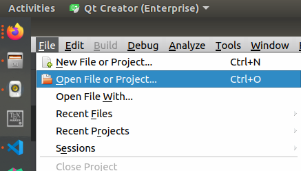
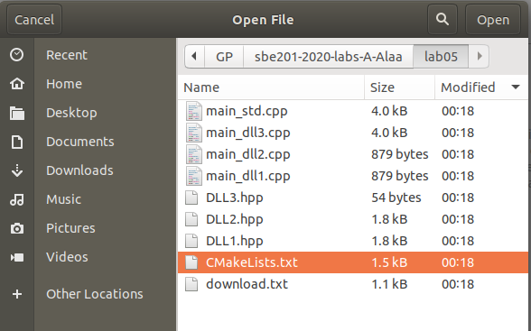
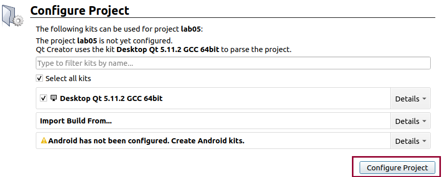

* TOC
{:toc}

## Initialize `lab05` files

### `wget`

You need to download the initial source files. `wget` program can help you in general to download files from the internet. In case you don't have it in your system you can install it using:

```bash
sudo apt install wget
```

### Download source files

Before downloading files, go to your lab repository and make `lab05` directory then go to the newly created folder:

```bash
mkdir lab05 # Execute in repo folder
cd lab05
```

There are **eight files** we need to download. However, we can first download a single text file that includes the links for the other 8 files.

```bash
wget https://raw.githubusercontent.com/sbme-tutorials/sbme-tutorials.github.io/master/2020/data-structures/snippets/lab05/linkedlists/download.txt
```

Now to download the **eight files** in a single command:

```bash
wget -i download.txt
```

Now if you list the files in the current directory you should see the following output:

<pre><font color="#8AE234"><b>asem@asem-pc</b></font>:<font color="#729FCF"><b>~/GP/sbe201-2020-labs-A-Alaa/lab05</b></font>$ ls
CMakeLists.txt  DLL2.hpp  download.txt   main_dll2.cpp  main_std.cpp
DLL1.hpp        DLL3.hpp  main_dll1.cpp  main_dll3.cpp
</pre>

From the QtCreator, open the current directory as a project by selecting `CMakeLists.txt` file.


<br>

<br>

<br>

<br>

<br>

<br>


## Application 1: remove duplicates from doubly linked list (procedural)

### Requirement 1: implementation of doubly linked list of integers

Complete the implementation of the following functions in the `DLL1.hpp` file:

1. `bool isEmpty( DLL &list )`
2. `void pushFront( DLL &list, int data )`
3. `void pushBack( DLL &list, int data )`
4. `void popNode( DLL &list, Node *node )`
5. `void popFront( DLL &list )`
6. `void popBack( DLL &list )`
7. `int getAt( DLL &list, int index )`
8. `void clear( DLL &list )`
9. `void print( DLL &l )`
10. `int size( DLL &list )`

### Requirement 2: implementation of duplicates removal algorithm

<!-- https://emgithub.com/ -->

<script src="https://emgithub.com/embed.js?target=https%3A%2F%2Fgithub.com%2Fsbme-tutorials%2Fsbme-tutorials.github.io%2Fblob%2Fmaster%2F2020%2Fdata-structures%2Fsnippets%2Flab05%2Flinkedlists%2Fmain_dll1.cpp&style=ir-black&showFileMeta=on"></script>

## Application 2: remove duplicates from doubly linked list (object)


<script src="https://emgithub.com/embed.js?target=https%3A%2F%2Fgithub.com%2Fsbme-tutorials%2Fsbme-tutorials.github.io%2Fblob%2Fmaster%2F2020%2Fdata-structures%2Fsnippets%2Flab05%2Flinkedlists%2Fmain_dll2.cpp&style=ir-black&showFileMeta=on"></script>

## Application 3: remove duplicates from doubly linked list (object+template)

<script src="https://emgithub.com/embed.js?target=https%3A%2F%2Fgithub.com%2Fsbme-tutorials%2Fsbme-tutorials.github.io%2Fblob%2Fmaster%2F2020%2Fdata-structures%2Fsnippets%2Flab05%2Flinkedlists%2Fmain_dll3.cpp&style=ir-black&showFileMeta=on"></script>

## Application 4: print COVID19 statistics (group by country)

<script src="https://emgithub.com/embed.js?target=https%3A%2F%2Fgithub.com%2Fsbme-tutorials%2Fsbme-tutorials.github.io%2Fblob%2Fmaster%2F2020%2Fdata-structures%2Fsnippets%2Flab05%2Flinkedlists%2Fmain_std.cpp&style=ir-black&showFileMeta=on"></script>