* TOC
{:toc}


This semester we will rely on the QtCreator as an Integrated Development Environment (IDE).

QtCreator ships with the powerful and rich project that features a large (or maybe the largest) spectrum of C++ libraries.

It is interesting to learn that many famous applications and organizations largely depend on Qt project. See the following lists from Wikipedia to learn about the most famous users of Qt: [3 Qt in use](https://en.wikipedia.org/wiki/Qt_(software)#Qt_in_use)


## Installing QtCreator

### Install Qt prerequisites

In Ubuntu, open your terminal (`Ctrl`+`Alt`+`T`) and copy paste the following command (to paste in the terminal: `Ctrl`+**`Shift`**+`V`), then hit `Enter`:

```bash
sudo apt install build-essential openssl libssl-dev libssl1.0 libgl1-mesa-dev wget
```

<div class="alert alert-primary" role="alert">

<i class="fas fa-info"></i> Notes:

* `sudo`: stands for _super user do_, and this is required when you make system-wide changes, like installing new libraries for the system. For detailed manual, write in the terminal `man sudo` then `Enter`. Press `Q` to close the manual and return to the terminal.
* `apt`: installation tool that links with large software repositories, so when you write `apt install x`, it will search for a package `x` within a stored database of the the available software in the linked repositories. You can install several packages at once like what we did in the command. Also, for detailed manual, write in the terminal `man apt` then `Enter`. Press `Q` to close the manual and return to the terminal.

</div>


### Download the offline installer

In this page: [Offline Qt Downloads](https://www.qt.io/offline-installers), you will find different download link for each system.

We will download from the following link [Qt 5.14.1 for Linux 64-bit (1.2 GB)](http://download.qt.io/official_releases/qt/5.14/5.14.1/qt-opensource-linux-x64-5.14.1.run) (Right click and _Save link as_). Alternatively, you can download files from the terminal using `wget` application. So, copy the download link and give it to the `wget`:

```bash
wget -c http://download.qt.io/official_releases/qt/5.14/5.14.1/qt-opensource-linux-x64-5.14.1.run
```

<div class="alert alert-primary" role="alert">

<i class="fas fa-info"></i> Notes:

* This will download `qt-opensource-linux-x64-5.14.1.run` into the terminal working directory. When you first open the terminal, its working directory is your home directory `~`.
* The flag `-c` means we ask `wget` to support continuing download in case the internet connection has broken, so it doesn't download the whole file again. More details can be found in the manual `man wget`.

</div>

### Installation

After downloading `qt-opensource-linux-x64-5.14.1.run`, from the terminal issue the following commands:

```bash
chmod a+x qt-opensource-linux-x64-5.14.1.run
sudo ./qt-opensource-linux-x64-5.14.1.run
```

This will pop up the installation wizard:

Press **Next**
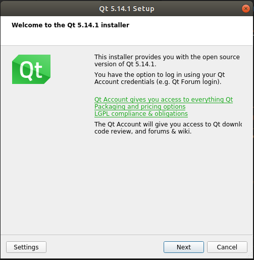

Create an account for the first time, then press **Next**:

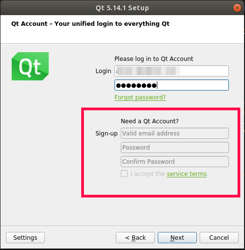

Tick for your consent to the obligations shown

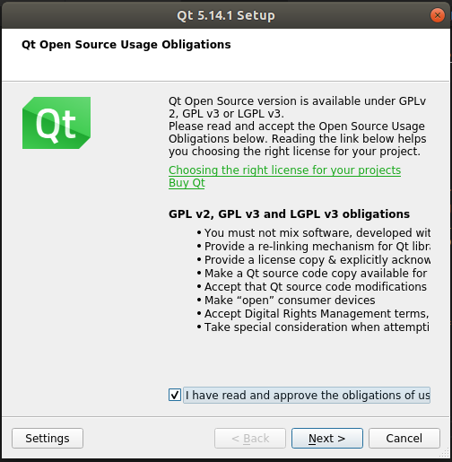

**Next**

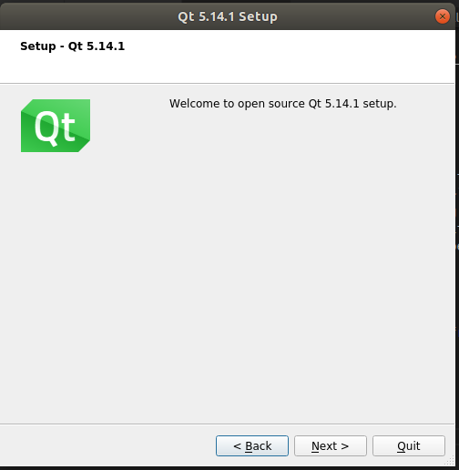

Specify the location of the installation, then **Next**:

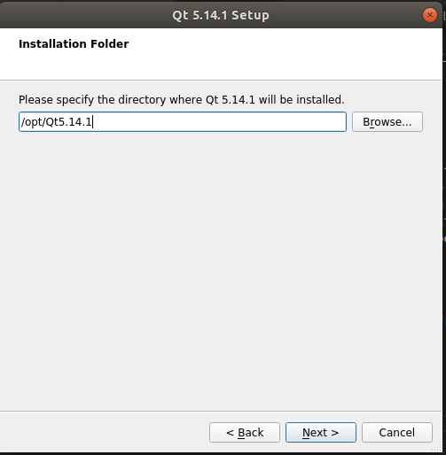

Just select the two items highlighted, then **Next**:

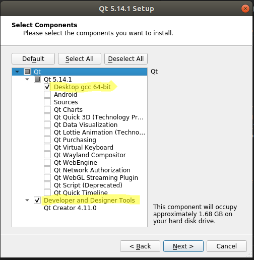

**Agree** for the listed licenses, then **Next**:

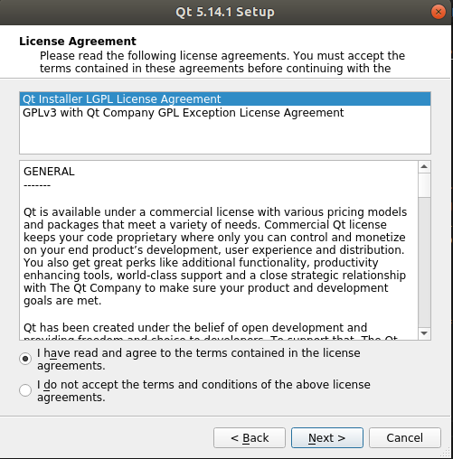

Finally proceed with **Install**, and **Finish**.

### Run your QtCreator

For the first time, open the Ubuntu dash  (at the left bottom corner), then look for _Qt_.
Alternatively, run directly from the terminal using:

```bash
/opt/Qt5.14.1/Tools/QtCreator/bin/qtcreator.sh
```

Finally, to add the QtCreator to the menu on the left as a shortcut, right click on the icon, then press _Add to the favourites_.

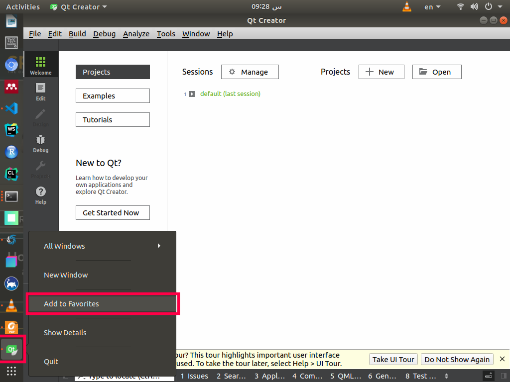


## Running your first project

Open QtCreator, and from the menu bar press **File**->**New File or Project..**

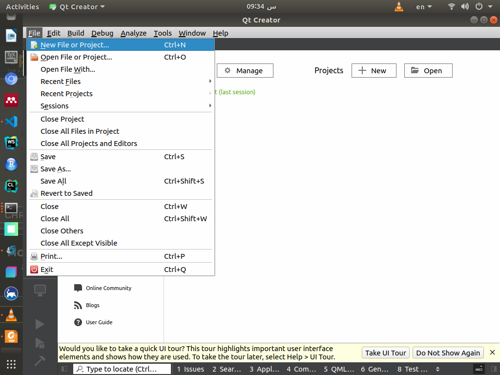


From the dialog menu, select **Application**->**Qt Console Application**->**Choose**

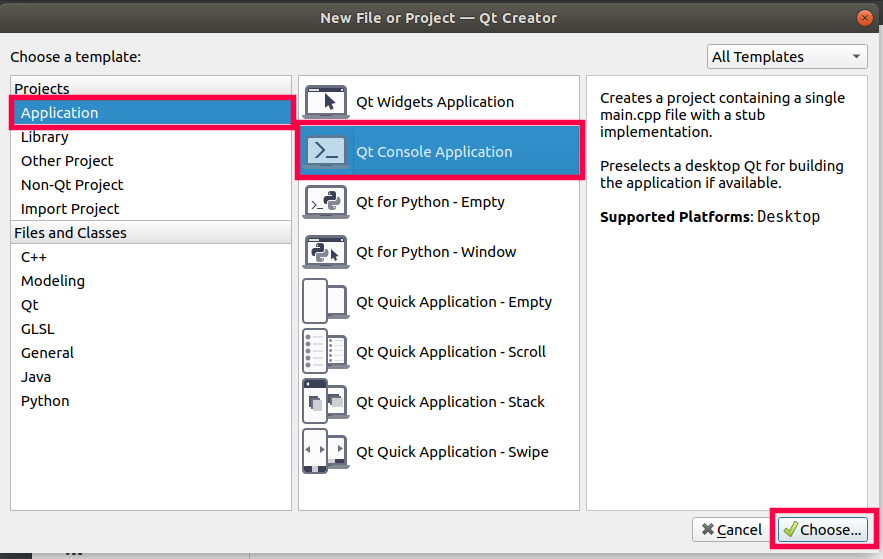


Select the location and the name of the project


<div class="alert alert-primary" role="alert">

<i class="fas fa-info"></i> Note:

* Avoid using spaces in a file or a folder name. Instead, use `-` or `_` to separate words. Alternatively, you may use _PascalCase_ naming convention.

</div>


Use **CMake** as a build system:

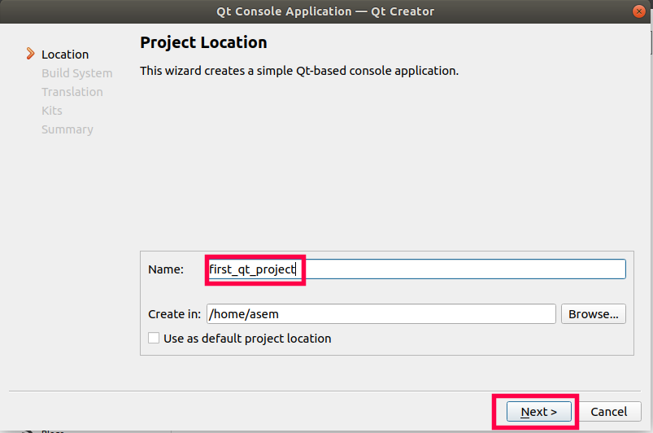


Now leave this as it is:

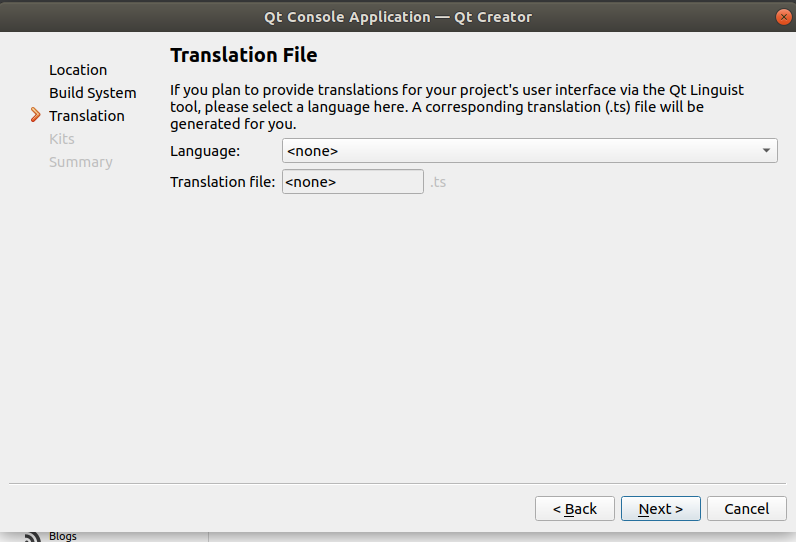


Leave as it is:

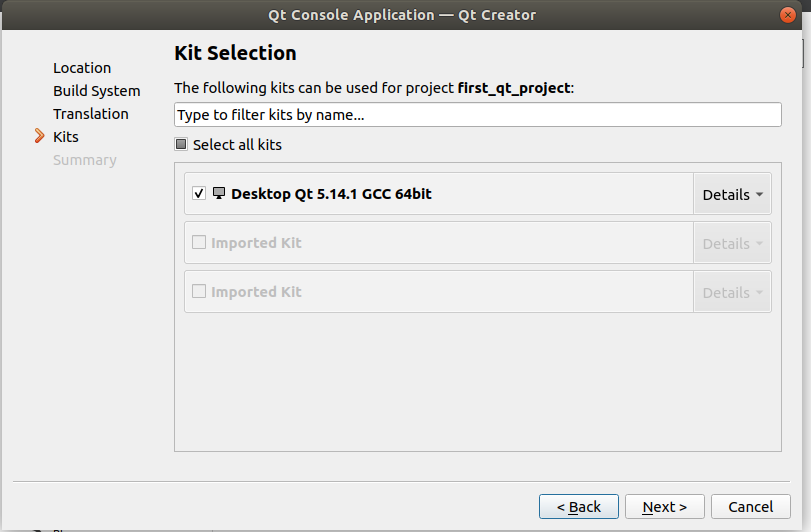


Now all is good, click **Finish**:

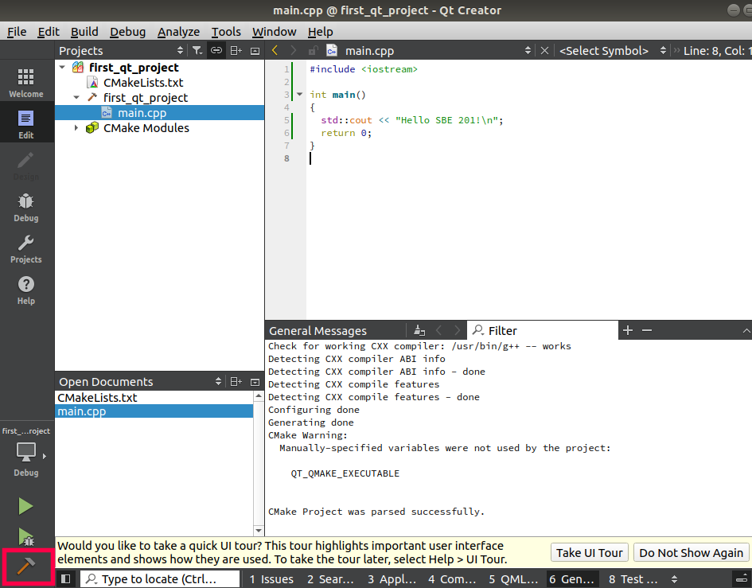


Finally, you will find the file `main.cpp` opened with the following content there:

```c++
#include <QCoreApplication>

int main(int argc, char *argv[])
{
  QCoreApplication a(argc, argv);

  return a.exec();
}
```


Instead let's use the following code:


```c++
#include <iostream>

int main()
{
  std::cout << "Hello SBE 201!\n";
  return 0;
}
```

Then press on the **Build** icon to compile your code:

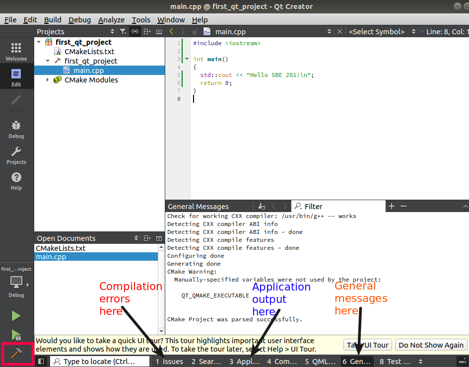


