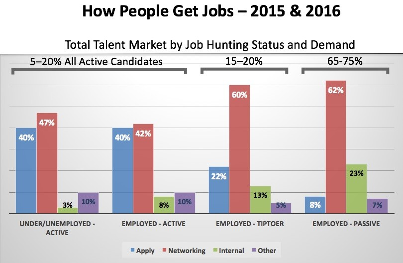

<textarea id="source">


## Revisiting Associative Containers: Hash Tables


* Array with a principled access patterns. 
* Each element in the array consists of a key and value.


---
## Hash table
### How do we store elements?

--
|  |
|--|
| A small phone book as a hash table,  Creative Commons: [Jorge Stolfi](https://commons.wikimedia.org/wiki/User:Jorge_Stolfi), [Hash Table \| Wikipedia](https://en.wikipedia.org/wiki/Hash_table) |

--

### Hash function

$$ \text{ index } = \text{ key } \% \text{ ARRAY_SIZE }$$

--
* Simplest hash function.

---
##### Example: Hashing DNA characters

Consider the following table of DNA four bases along with their ascii code values:

| Base | Ascii | Hash0: $ \text{ key } \% \text{ 3 } $| Hash1: $ \text{ key } \% \text{ 5 } $ | Hash2:  $ \text{ key } \% \text{ 13 }$ |
|---|---|---|---|---|
| A | 65 |  2 | 0 | 0 |
| C | 67 | 1 | 2 | 2 |
| G | 71 | 2 | 1 | 6 |
| T | 84 | 0 | 4 | 6 |

--
* Any concerns?
--
* .red[Hash collision].

---
### Hash collision handling

--
#### Method 1: Chaining

|  |
|--|
| Hash collision resolved by separate chaining,  Creative Commons: [Jorge Stolfi](https://commons.wikimedia.org/wiki/User:Jorge_Stolfi), [Hash Table \| Wikipedia](https://en.wikipedia.org/wiki/Hash_table) |

--
1. We hash the key to an index.
--
2. All keys mapped to the same index are stored in the same list.

---
##### Element Structure

--
```c++
struct HashElement
{
    char key;
    int value;
};
```

---
##### Table Structure

--
```c++
struct HashChainingTable
{
    std::array< std::list< HashElement > , 100 > bucket;
};
```

---
##### Hash Function

--
```c++
int hash(HashChainingTable &table, char key)
{
    return key % table.bucket.size();
}
```

---
##### Empty Function

--
```c++
bool isEmpty(HashChainingTable &table)
{
    for (int i = 0; i < table.bucket.size(); ++i)
        if (!table.bucket[i].empty())
            return false;
    return true;
}
```

---
##### Empty Function (ranged for-loop)

```c++
bool isEmpty(HashChainingTable &table)
{
    for (const auto &b : table.bucket )
        if (!b.empty())
            return false;
    return true;
}
```

---
##### Empty Function (`std::all_of` + lambda)

```c++
bool isEmpty(HashChainingTable &table)
{
    return std::all_of(  table.bucket.cbegin(),  table.bucket.cend(),
        []( auto &b ){ return b.empty()});
}
```

--
- read about iterators.
- read about lambda expressions in C++.
- read documentation of `std::all_of`, `std::any_of`.

---
##### Size Function

```c++
int size(HashChainingTable &table)
{
    int mSize = 0;
    for (int i = 0; i < table.bucket.size(); ++i)
        mSize += table.bucket[i].size();
    return mSize;
}
```

---
##### Size Function (ranged for-loop)

--
```c++
int size(HashChainingTable &table)
{
    int mSize = 0;
    for (const auto &b : table.bucket)
        mSize += b.size();
    return mSize;
}
```

---
##### Size Function (`std::accumulate` + lambda expression)

```c++
int size(HashChainingTable &table)
{
    return std::accumulate( table.bucket.cbegin() , table.bucket.cend(), 0 ,
    []( int acc , auto &b ))
    {
        return acc + b.size();
    });
}
```

--
- read about iterators.
- read about lambda expressions in C++.
- read documentation of `std::all_of`, `std::any_of`.

---
##### Find Function

--
```c++
bool find(HashChainingTable &table, char key)
{
    int index = hash(table, key);
    std::list<HashElement> &slot = table.bucket[index];
    for (HashElement &element : slot)
        if (element.key == key)
            return true;
    return false;
}
```

--
- Consider a more concise solution using `std::find_if` + lambda.

---
##### At Function

--
```c++
int &at(const HashChainingTable &table, char key)
{
    int index = hash(table, key);
    std::list<HashElement> &slot = table.bucket[index];
    for (HashElement &element : slot)
        if (element.key == key)
            return element.value;

    std::cout << "Key not found!" << std::endl;
    exit(1);
}
```

--
- Consider a more concise solution using `std::find_if` + lambda.

---
##### Insert Function

```c++
void insert(HashChainingTable &table, char key, int value)
{
    if (!find(table, key))
    {
        HashElement newElement{key, value};
        int index = hash(table, key);
        std::list<HashElement> &slot = table.bucket[index];
        slot.push_back(newElement);
    }
}
```

---
##### Remove Function

--
```c++
void remove(HashChainingTable &table, char key)
{
    int index = hash(table, key);
    std::list<HashElement> &slot = table.bucket[index];
    for (auto it = slot.begin(); it != slot.end(); ++it)
        if (it->key == key)
            slot.erase(it);
}
```

---
##### Value Function

--
```c++
int &value(HashChainingTable &table, char key)
{
    if (!find(table, key))
    {
        insert(table, key , 0 );
    }
    return at(table, key);
}
```

---
##### Clear Function

--
```c++
void clear(HashChainingTable &table)
{
    for (auto &slot : table.bucket )
        slot.clear();
}
```

---
##### Print All Function

--
```c++
void printAll(const HashChainingTable &table)
{
    for (auto &slot : table.bucket )
        for (auto &element : slot)
            std::cout << element.key << ":" << element.value << std::endl;
}
```

---
#### Method 2: Linear Probing

--
|  |
|--|
| Hash collision resolved by open addressing with linear probing,  Creative Commons: [Jorge Stolfi](https://commons.wikimedia.org/wiki/User:Jorge_Stolfi), [Hash Table \| Wikipedia](https://en.wikipedia.org/wiki/Hash_table) |

--
.small[
1. We hash the key to an index.
2. We check if that index is occupied or not by other element. If occupied, increment the index until you find available slot.
3. Store.]

---
## Map (ADT) on Hash Table

```c++
#include "hash_chaining.hpp"
#include "helpers.hpp"

int main( int argc, char **argv )
{
    if( argc == 2 )
    {
        std::string dna = getFileFirstLine( argv[1] );

        hash::HashChainingTable cMap;
        // Complete here!
        for( auto b : dna )
            hash::value( cMap , b )++;

        // Done here!
        hash::printAll( cMap );
    }
    return 0;
}
```

---

**Clone the code**:

```bash
git clone https://github.com/sbme-tutorials/sbe201-hashes.git
```

---
## Programming Languages and Research Interests

--
* You are highly recommended to develop research interests in few domains. 
* Research interests makes your cover letters very attractive.

---
## Domestic Internships

Domestic internships are typically found and admitted through several channels.

---
### Networking



* [New Survey Reveals 85% of All Jobs are Filled Via Networking](https://www.linkedin.com/pulse/new-survey-reveals-85-all-jobs-filled-via-networking-lou-adler/)

---
### Networking events

--


* [Meetup \| IBM Cloud Egypt](https://www.meetup.com/IBM-Cloud-Egypt/)


---
### Job fairs and direct announcements.

---
### Applications and search engines

--
1. [Wuzzuf search engine](https://wuzzuf.net/jobs/egypt); use the appropriate keywords, for example: "internship web", "internship machine learning", "internship computer vision", etc.

---
## International Internships

--
### Research Experience for Undergraduates (REU)

<blockquote class="twitter-tweet" data-lang="en"><p lang="en" dir="ltr">I&#39;ve seen several Tweets telling STEM undergrads to apply for REUs, but the replies are always filled with &quot;what&#39;s an REU?&quot; So, here&#39;s a thread about what REUs are, why you should consider applying, and how to find the right one for you:</p>&mdash; Celeste Labedz (@celestelabedz) <a href="https://twitter.com/celestelabedz/status/1083072664514646016?ref_src=twsrc%5Etfw">January 9, 2019</a></blockquote>
<script async src="https://platform.twitter.com/widgets.js" charset="utf-8"></script>


---
### Common Requirements for applications

#### Catchy resume

--
Suggestions:

1. [Resumake](https://latexresu.me/): 
    * Resumake is a tool for automatically generating beautiful resumes.
    * You can export to LaTeX for further editing.
1. \[[Your curriculum in LaTeX - part one](http://web.archive.org/web/20120111021524/http://stefano.italians.nl/archives/5)\]\[[part two](http://web.archive.org/web/20111127150043/http://stefano.italians.nl/archives/14)\] \[[part three ](http://web.archive.org/web/20120103055952/http://stefano.italians.nl/archives/26)\] \[[part four](http://web.archive.org/web/20120117043729/http://stefano.italians.nl/archives/50)\]


---
### Common Requirements for applications

#### Recommendation letters

--
* all your teachers owe you a recommendation letter. 
* Recommenders from diverse schools or places makes potential recommendation.

---
### Common Requirements for applications

#### Motivation letter (aka cover letters, statement of purpose)

to reflect your strong reasons to apply for the internship. You should also convey your engineering skills and your research interests. General guidelines:

--
* **Paragraph 1:** Introduce yourself and talk about some interesting milestones if you have.
--
* **Paragraph 2-3:** Describe the general areas of research that interest you and why. Prove some interests by an overview of online courses, projects, or other internships in the field.
--
* **Paragraph 4:** Tell us a little bit about yourself and your life experiences. Why do you feel you need that position?
--
* \[[Cover letter with style - part one ](http://web.archive.org/web/20120106084130/http://stefano.italians.nl/archives/55)\] \[[2](http://web.archive.org/web/20120106084426/http://stefano.italians.nl/archives/61)\] \[[3](http://web.archive.org/web/20120103000013/http://stefano.italians.nl/archives/62)\] \[[4](http://web.archive.org/web/20120103000017/http://stefano.italians.nl/archives/63)\] \[[5](http://web.archive.org/web/20120103000023/http://stefano.italians.nl/archives/64)\] \[[6](http://web.archive.org/web/20120103000109/http://stefano.italians.nl/archives/65)\]

---
### Common Requirements for applications

* Grades: GPA (generally > 3.2)
* Rank (sometimes): top 5%
* English and GRE scores (sometimes)


---
### List of International Summer Schools

See the notes.


---
## Research Interests

--
A suggested list for research interests that you may dedicate this summer to learn about.

--
* Artificial Intelligence and Machine Learning
* Data Science and Big Data
* High Performance Computing and Distributed Systems
* Bioinformatics
* Computational Neuroscience
* Algorithms Design and Theoretical Computer Science
* Security, Cryptography, and Blockchain
* Computer Architecture, Integrated Circuits Manufacturing, MEMS, NEMS

</textarea>
