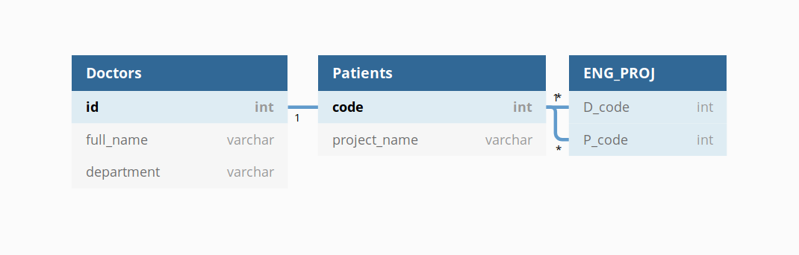

---
# You don't need to edit this file, it's empty on purpose.
# Edit theme's home layout instead if you wanna make some changes
# See: https://jekyllrb.com/docs/themes/#overriding-theme-defaults
layout: page
category: "notes"
course: "hemn230"
year: "2020"
---
* TOC
{:toc}

## Practice 1

You are requires to write create the following tables inside your python database through python mysql-connector.

## Instructions
1. Individual Assignment
2. Deadline: Thurusday: 24 Dec 2020
3. Assignment will be discussed in the next tutorial

## Helpers

* Create the following table:



Python/SQL query:

**please run the following python code to create the database and the tables**
```python
import mysql.connector

mydb = mysql.connector.connect(
  host="localhost",
  user="root",
  passwd="mysql"
)

mycursor = mydb.cursor()
mycursor.execute("CREATE DATABASE databaseSubmissions")

mydb = mysql.connector.connect(
  host="localhost",
  user="root",
  passwd="mysql",
  database="databaseSubmissions"
)
mycursor = mydb.cursor()

mycursor.execute("CREATE TABLE Doctors (name VARCHAR(255),department VARCHAR(255), id INT, PRIMARY KEY(id))")
mycursor.execute("CREATE TABLE Patients (name VARCHAR(255), id INT, PRIMARY KEY(id))")
mycursor.execute("CREATE TABLE DOC_PAT ( D_code INT, P_code INT, FOREIGN KEY (P_code) REFERENCES Patients(id),FOREIGN KEY (D_code) REFERENCES Doctors(id))")
```

Write a python program for doctors hospital that:
1. asks to add new doctor
2. asks to add new patient
3. asks to relate patient and doctor
4. asks to view list of doctors names
5. asks to view list of patients names
6. asks to view list of patient and corresponding doctor
7. terminate a patient doctor relationship
8. view patients names supervised by selected doctor
9. view doctors names supervises a selected patient

**please following ths same style in the following video** [video](https://drive.google.com/file/d/14HPatJWCGZ28KF81VRl8f1vZbhWwkVFB/view?usp=sharing)