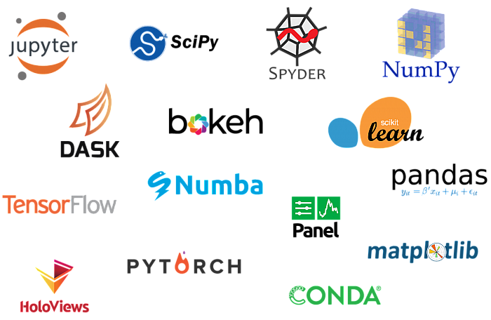

* TOC
{:toc}


## General Info

* Interpreted language 
* Untyped language
* Indentation (No Brackets)
* Cross platform

## Installation 

* Download and install [Anaconda](https://www.anaconda.com/products/individual) 


* Chiped with some awesome apps (Jupyter, Spyder) and important packages 



* Opetionally install [vscode](https://code.visualstudio.com/)
    

## Hello world


```python
print("Hello, World!")
```

    Hello, World!


##  Variables and data types


```python
# Integers
myint = 7
print(myint)
```

    7


```python
# Floats
myfloat = 7.0
print(myfloat)
myfloat = float(7)
print(myfloat)
```

    7.0
    7.0


```python
# Strings
mystring = 'hello'
print(mystring)
mystring = "hello"
print(mystring)
```

    hello
    hello


```python
# Operations (Numerical)
one = 1
two = 2
three = one + two
print(three)
```

    3


```python
# Operations (Strings)
hello = "hello"
world = "world"
helloworld = hello + world
print(helloworld)
```

    helloworld


```python
# What do you think ? 
one = 1
two = 2
hello = "hello"
print(str(one) + str(two) + hello)
```

    12hello


```python
# Variable assignment
a, b = 3, 4
print(a,b)
```

    3 4


## Lists


```python
mylist = []
```


```python
mylist.append(1)
mylist
```


    [1]


```python
mylist.append(2)
mylist.append(3)
mylist
```


    [1, 2, 3]


```python
# What do you think? 
print(mylist[1])
```

    2


```python
mylist[1] = 5
print(mylist)
```

    [1, 5, 3]


```python
# What do you think will happen? 
mylist = [1,2,3]
# print(mylist[3])
```


```python
another_list = [1, "jlkadsjlkc", 12.6]
another_list
```


    [1, 'jlkadsjlkc', 12.6]


```python
mylist = ["Welcome", "to", "Biostatistics", "class", "spring", "2021"]
```


```python
mylist[2:4]
```


    ['Biostatistics', 'class']


```python
mylist[0:6:2]
```


    ['Welcome', 'Biostatistics', 'spring']


```python
mylist[::2]
```


    ['Welcome', 'Biostatistics', 'spring']


```python
mylist[-1]
```


    '2021'


```python
mylist[::-1]
```


    ['2021', 'spring', 'class', 'Biostatistics', 'to', 'Welcome']


```python
print(mylist.pop())
print(mylist)
```

    2021
    ['Welcome', 'to', 'Biostatistics', 'class', 'spring']


### Tuples


```python
mytuple = (1, 2, 3)
print(mytuple[1])
print(mytuple)
```

    2
    (1, 2, 3)


```python
a, b, c = mytuple
print(a)
print(b)
print(c)
```

    1
    2
    3


```python
# Cann't override
# mytuple[1] = 5 
```

### Dictionary


```python
mydict = {"sbme":"Systems and Biomedical Engineering",
          "class": 2,
          1:"Python Tutorials"}
```


```python
mydict['sbme']
```


    'Systems and Biomedical Engineering'


```python
mydict['class']
```


    2


```python
mydict[1]
```


    'Python Tutorials'


```python
mydict['New'] = "Another Item"
mydict
```


    {'sbme': 'Systems and Biomedical Engineering',
     'class': 2,
     1: 'Python Tutorials',
     'New': 'Another Item'}


```python
mydict.update({"New":123, 1:"k;sad;sakc"})
mydict
```


    {'sbme': 'Systems and Biomedical Engineering',
     'class': 2,
     1: 'k;sad;sakc',
     'New': 123}


```python
del mydict['New']
mydict
```


    {'sbme': 'Systems and Biomedical Engineering', 'class': 2, 1: 'k;sad;sakc'}


### Sets


```python
myset = {1, 2, 3}
myset
```


    {1, 2, 3}


```python
myset.add(4)
myset
```


    {1, 2, 3, 4}


```python
myset.add(3)
```


```python
myset
```


    {1, 2, 3, 4}


## Basic Operators

### Numerical 


```python
number = 1 + 2 * 3 / 4.0
print(number)
```

    2.5


```python
remainder = 5 % 3
print(remainder)
```

    2


```python
squared = 7 ** 2
cubed = 2 ** 3
print(squared)
print(cubed)
```

    49
    8


### Strings 


```python
helloworld = "hello" + " " + "world"
print(helloworld)
```

    hello world


```python
lotsofhellos = "hello \n" * 10
print(lotsofhellos)
```

    hello 
    hello 
    hello 
    hello 
    hello 
    hello 
    hello 
    hello 
    hello 
    hello 
    


### Lists


```python
even_numbers = [2,4,6,8]
odd_numbers = [1,3,5,7]
all_numbers = odd_numbers + even_numbers
print(all_numbers)
```

    [1, 3, 5, 7, 2, 4, 6, 8]


```python
print([1,2,3] * 3)
```

    [1, 2, 3, 1, 2, 3, 1, 2, 3]


## String Formatting 


```python
# This prints out "Hello, John!"
name = "John"
print("Hello, %s!" % name)
```

    Hello, John!


```python
# This prints out "John is 23 years old."
name = "John"
age = 23
print("%s is %d years old." % (name, age))
```

    John is 23 years old.


```python
# This prints out: A list: [1, 2, 3]
mylist = [1,2,3]
print("A list: %s" % mylist)
```

    A list: [1, 2, 3]


```python
data = ("John", "Doe", 53.44) # tuple
# Hello John Doe. Your current balance is $53.44.
string_to_print = "Hello %s %s. Your current balance is $%s"
print(string_to_print%data)
```

    Hello John Doe. Your current balance is $53.44


## Conditions

### Boolean Variable 


```python
x = True
y = False
print(x)
print(y)
```

    True
    False


```python
x = 2
print(x == 2) # prints out True
print(x == 3) # prints out False
print(x < 3) # prints out True
```

    True
    False
    True


### If condition


```python
x = 5
if x == 2:
    print("Inside IF")
print("Outside IF")
```

    Outside IF


### Boolean operators


```python
name = "John"
age = 23
if name == "John" and age == 23:
    print("Your name is John, and you are also 23 years old.")

if name == "John" or name == "Rick":
    print("Your name is either John or Rick.")
```

    Your name is John, and you are also 23 years old.
    Your name is either John or Rick.


### In Operator


```python
name = "John"
names_list = ["John", "Rick"]
if name in names_list:
    print("Your name is either John or Rick.")
```

    Your name is either John or Rick.


### Is Operator


```python
x = [1,2,3]
y = [1,2,3]
print(x == y) # Prints out True
print(x is y) # Prints out False
x = y 
print(x is y)
```

    True
    False
    True


### Not operator


```python
print(not False) # Prints out True
print((not False) == (False)) # Prints out False
```

    True
    False


### If, else


```python
x = 2
if x == 2:
    print("x equals two!")
else:
    print("x does not equal to two.")
```

    x equals two!


### If, elif, .. 


```python
statement = False
another_statement = True
if statement is True:
    # do something
    pass
elif another_statement is True: # else if
    # do something else
    pass
else:
    # do another thing
    pass
```


## Loops 

### For Loop


```python
primes = [2, 3, 5, 7]
for prime in primes:
    print(prime)
```

    2
    3
    5
    7


```python
# Prints out the numbers 0,1,2,3,4
for x in range(5):
    print(x)

# Prints out 3,4,5
for x in range(3, 6):
    print(x)

# Prints out 3,5,7
for x in range(3, 8, 2):
    print(x)
```

    0
    1
    2
    3
    4
    3
    4
    5
    3
    5
    7


### While Loop


```python
# Prints out 0,1,2,3,4

count = 0
while count < 5:
    print(count)
    count += 1  # This is the same as count = count + 1
```

    0
    1
    2
    3
    4


### break and continue


```python
# Prints out 0,1,2,3,4

count = 0
while True:
    print(count)
    count += 1
    if count >= 5:
        break

```

    0
    1
    2
    3
    4


```python
# Prints out only odd numbers - 1,3,5,7,9
for x in range(10):
    # Check if x is even
    if x % 2 == 0:
        continue
    print(x)
```

    1
    3
    5
    7
    9


## Functions


```python
def my_function():
    print("Hello From My Function!")
```


```python
my_function()
```

    Hello From My Function!


```python
def sum_two_numbers(a, b):
    return a + b
```


```python
sum_two_numbers(5, 10)
```


    15


```python
result = sum_two_numbers(5, 10)
result
```


    15


## References and useful links

* [learnpython](https://www.learnpython.org/)


