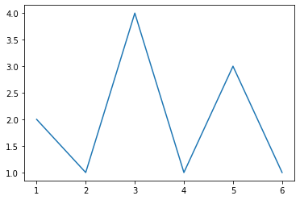
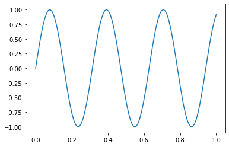
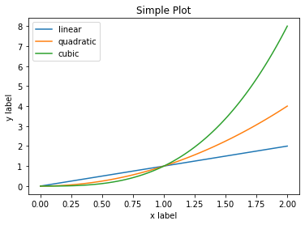
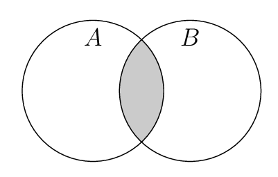
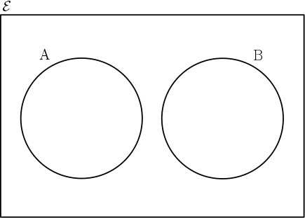

* TOC
{:toc}


# Python Basics Cont

## Classes and Objects


```python
class MyClass:
    variable = "my_variable"

    def function(self):
        print("This is a message inside the class.")
```


```python
# Instantiation
c = MyClass()
```


```python
# accessing variables
c.variable
```


    'my_variable'


```python
# accessing and calling functions
c.function()
```

    This is a message inside the class.


## Modules and packages 


```python
import numpy 
data = [10, 20, 30, 40, 50]
numpy.mean(data)
```


    30.0


```python
import numpy as np
np.mean(data)
```


    30.0


```python
np.std(data)
```


    14.142135623730951


### Numpy array


```python
myarray = np.array([1, 9, 4, 5])
myarray
```


    array([1, 9, 4, 5])


```python
myarray.sum()
```


    19


```python
myarray.mean()
```


    4.75


```python
myarray.sort()
myarray
```


    array([1, 4, 5, 9])


## Pandas 


```python
import pandas as pd
```


```python
country    =  ["Brazil", "Russia", "India", "China", "South Africa"]
capital    =  ["Brasilia", "Moscow", "New Dehli", "Beijing", "Pretoria"]
area       =  [ 8.516, 17.10, 3.286, 9.597, 1.221]
population =  [200.4, 143.5, 1252, 1357, 52.98] 

brics = pd.DataFrame(data={"country":country, "capital":capital, "area":area, "population":population})
brics
```


<div>
<style scoped>
    .dataframe tbody tr th:only-of-type {
        vertical-align: middle;
    }

    .dataframe tbody tr th {
        vertical-align: top;
    }

    .dataframe thead th {
        text-align: right;
    }
</style>
<table border="1" class="dataframe">
  <thead>
    <tr style="text-align: right;">
      <th></th>
      <th>country</th>
      <th>capital</th>
      <th>area</th>
      <th>population</th>
    </tr>
  </thead>
  <tbody>
    <tr>
      <td>0</td>
      <td>Brazil</td>
      <td>Brasilia</td>
      <td>8.516</td>
      <td>200.40</td>
    </tr>
    <tr>
      <td>1</td>
      <td>Russia</td>
      <td>Moscow</td>
      <td>17.100</td>
      <td>143.50</td>
    </tr>
    <tr>
      <td>2</td>
      <td>India</td>
      <td>New Dehli</td>
      <td>3.286</td>
      <td>1252.00</td>
    </tr>
    <tr>
      <td>3</td>
      <td>China</td>
      <td>Beijing</td>
      <td>9.597</td>
      <td>1357.00</td>
    </tr>
    <tr>
      <td>4</td>
      <td>South Africa</td>
      <td>Pretoria</td>
      <td>1.221</td>
      <td>52.98</td>
    </tr>
  </tbody>
</table>
</div>


```python
# Save data
pd.DataFrame.to_csv(brics,"brics.csv", index=0)
```


```python
loaded_data = pd.read_csv("brics.csv")
```


```python
loaded_data 
```


<div>
<style scoped>
    .dataframe tbody tr th:only-of-type {
        vertical-align: middle;
    }

    .dataframe tbody tr th {
        vertical-align: top;
    }

    .dataframe thead th {
        text-align: right;
    }
</style>
<table border="1" class="dataframe">
  <thead>
    <tr style="text-align: right;">
      <th></th>
      <th>country</th>
      <th>capital</th>
      <th>area</th>
      <th>population</th>
    </tr>
  </thead>
  <tbody>
    <tr>
      <td>0</td>
      <td>Brazil</td>
      <td>Brasilia</td>
      <td>8.516</td>
      <td>200.40</td>
    </tr>
    <tr>
      <td>1</td>
      <td>Russia</td>
      <td>Moscow</td>
      <td>17.100</td>
      <td>143.50</td>
    </tr>
    <tr>
      <td>2</td>
      <td>India</td>
      <td>New Dehli</td>
      <td>3.286</td>
      <td>1252.00</td>
    </tr>
    <tr>
      <td>3</td>
      <td>China</td>
      <td>Beijing</td>
      <td>9.597</td>
      <td>1357.00</td>
    </tr>
    <tr>
      <td>4</td>
      <td>South Africa</td>
      <td>Pretoria</td>
      <td>1.221</td>
      <td>52.98</td>
    </tr>
  </tbody>
</table>
</div>


## Matplotlib


```python
%matplotlib inline
```


```python
import matplotlib.pyplot as plt
```

### Simple plot


```python
x = [1, 2, 3, 4, 5, 6]
y = [2, 1, 4, 1, 3, 1]
plt.plot(x, y)  # Plot some data on the axes.
```


    [<matplotlib.lines.Line2D at 0x7f632c12d090>]





### Signal Plotting 


```python
t = np.linspace(0, 1, 100)
sig = np.sin(20*t)
plt.plot(t, sig)
```


    [<matplotlib.lines.Line2D at 0x7f632c0c1dd0>]





### Multiple plots for same figure


```python
x = np.linspace(0, 2, 100)
# Note that even in the OO-style, we use `.pyplot.figure` to create the figure.
fig, ax = plt.subplots()  # Create a figure and an axes.
ax.plot(x, x, label='linear')  # Plot some data on the axes.
ax.plot(x, x**2, label='quadratic')  # Plot more data on the axes...
ax.plot(x, x**3, label='cubic')  # ... and some more.
ax.set_xlabel('x label')  # Add an x-label to the axes.
ax.set_ylabel('y label')  # Add a y-label to the axes.
ax.set_title("Simple Plot")  # Add a title to the axes.
ax.legend()  # Add a legend.
```


    <matplotlib.legend.Legend at 0x7f632c0261d0>





# Introduction to Probability Theroy 

* Random Experiment 
* Sample Space 
* Event 
* Probability of event

## Example

|Random Experiment | Coin Tossing  
|------------------|------------|
|Sample Space       | {Head, Tail}|
|Event            | Head|
|Probabilty of Event | 0.5 |

## Axioms of probability




𝑃(𝑆)=1 

0≤𝑃(𝐴)≤1

𝑃(𝐴∪𝐵)=𝑃(𝐴)+𝑃(𝐵)−𝑃(𝐴∩𝐵)

If  𝐴∩𝐵=𝜙  so  𝑃(𝐴∩𝐵)=0  and they called matually execlusive, Where  𝜙  is the Null set.

## Set theory basics

Possible outcomes of an experiment (Sample space)

### Set relationships
* Subset
* Superset
* Disjoint
* Universal set
* Null set

### Example


```python
Univ = set([x for x in range(11)])
even = set([x for x in range(11) if x%2==0])
odd = set([x for x in range(11) if x%2==1])
two_elements = set([4,6])
Null = set()
```


```python
print("Universal set :",Univ)
print("-"*30)
print("Even set:",even)
print("-"*30)
print("Odd set:",odd)
print("-"*30)
print("Set of 2 elements:",two_elements)
print("-"*30)
print("A null set:", Null)
```

    Universal set : {0, 1, 2, 3, 4, 5, 6, 7, 8, 9, 10}
    ------------------------------
    Even set: {0, 2, 4, 6, 8, 10}
    ------------------------------
    Odd set: {1, 3, 5, 7, 9}
    ------------------------------
    Set of 2 elements: {4, 6}
    ------------------------------
    A null set: set()


```python
print('Is "even" a subset of "Univ" ?',even.issubset(Univ))
print("-"*30)
print('Is "Univ" a superset of "even" ?',Univ.issuperset(even))
print("-"*30)
print('Is "even" disjoint with "odd"?',even.isdisjoint(odd))
```

    Is "even" a subset of "Univ" ? True
    ------------------------------
    Is "Univ" a superset of "even" ? True
    ------------------------------
    Is "even" disjoint with "odd"? True


### Set algebra/Operations


**Equality**

 **𝑆1=𝑆2**


```python
S1 = {1,2}
S2 = {2,1}
print(S1)
print(S2)
print (S1==S2)
```

    {1, 2}
    {1, 2}
    True


```python
S1 = {1,2,3}
S2 = {1,2,4}
print(S1)
print(S2)
print (S1==S2)
```

    {1, 2, 3}
    {1, 2, 4}
    False


**Intersection**

**𝑆1∩𝑆2**


```python
S1 = {9, 3, 6}
S2 = {1, 2, 3, 4, 5, 6}
```


```python
S1.intersection(S2)
```


    {3, 6}


**Union**

**𝑆1∪𝑆2**


```python
S1.union(S2)
```


    {1, 2, 3, 4, 5, 6, 9}


**Difference**

**𝑆1−𝑆2**
 
**𝑆2−𝑆1**


```python
S2.difference(S1)
```


    {1, 2, 4, 5}


```python
S1.difference(S2)
```


    {9}


**Complement**

**𝑆′={𝑥∈𝑈,𝑥∉𝑆}**


```python
U = {1 ,2 , 3 ,4}
S = {1, 2}

```


```python
S_complement = {e for e in U if e not in S}
S_complement
```


    {3, 4}


**Cartesian product**

**𝑆1×𝑆2**


```python
from itertools import product as prod
S1 = {1, 2 , 3}
S2 = {4, 5}
all_combinations = list(prod(S1, S2))
print("Number of outcomes = 2x3 :  " , len(all_combinations))
print("All possible outcomes :" , all_combinations)
```

    Number of outcomes = 2x3 :   6
    All possible outcomes : [(1, 4), (1, 5), (2, 4), (2, 5), (3, 4), (3, 5)]


**Cartesian Power**

**𝑆^𝑛=𝑆×𝑆×𝑆...**


```python
# Tossing Coin
S = {"H", "T"} # Head or tale
n = 2   # Two times
possible_outcomes = list(prod(S, repeat=n))
possible_outcomes
```


    [('H', 'H'), ('H', 'T'), ('T', 'H'), ('T', 'T')]


```python
n = 3   # Three times
possible_outcomes = list(prod(S, repeat=n))
possible_outcomes
```


    [('H', 'H', 'H'),
     ('H', 'H', 'T'),
     ('H', 'T', 'H'),
     ('H', 'T', 'T'),
     ('T', 'H', 'H'),
     ('T', 'H', 'T'),
     ('T', 'T', 'H'),
     ('T', 'T', 'T')]


## Exercises

Provide a reasonable description of the sample space for each
of the random experiments

### Ex 2-2

Each of four transmitted bits is classified as either in error
or not in error.


```python
# Ex 2-2 
options = {'E', 'N'}
S = list(prod(options, repeat = 4))
print("Total number of samples 2^4 = ", len(S))
S
```

    Total number of samples 2^4 =  16


    [('N', 'N', 'N', 'N'),
     ('N', 'N', 'N', 'E'),
     ('N', 'N', 'E', 'N'),
     ('N', 'N', 'E', 'E'),
     ('N', 'E', 'N', 'N'),
     ('N', 'E', 'N', 'E'),
     ('N', 'E', 'E', 'N'),
     ('N', 'E', 'E', 'E'),
     ('E', 'N', 'N', 'N'),
     ('E', 'N', 'N', 'E'),
     ('E', 'N', 'E', 'N'),
     ('E', 'N', 'E', 'E'),
     ('E', 'E', 'N', 'N'),
     ('E', 'E', 'N', 'E'),
     ('E', 'E', 'E', 'N'),
     ('E', 'E', 'E', 'E')]


### Ex 2-6

An ammeter that displays three digits is used to measure
current in milliamperes


```python
# Ex 2-6 
options = {a for a in range(0, 10)}
options
```


    {0, 1, 2, 3, 4, 5, 6, 7, 8, 9}


```python
S = list(prod(options, repeat = 3))
print("Total number of samples 10^3 = ", len(S))

print("\n The sample Space : \n", "="*15)

for i in range(5):
    print(S[i])

for i in range(5):
    print("."*8)
    
for i in range(-5,0):
    print(S[i])

```

    Total number of samples 10^3 =  1000
    
     The sample Space : 
     ===============
    (0, 0, 0)
    (0, 0, 1)
    (0, 0, 2)
    (0, 0, 3)
    (0, 0, 4)
    ........
    ........
    ........
    ........
    ........
    (9, 9, 5)
    (9, 9, 6)
    (9, 9, 7)
    (9, 9, 8)
    (9, 9, 9)


### Ex 2-16

An order for a computer system can specify memory of 4,
8, or 12 gigabytes and disk storage of 200, 300, or 400 gigabytes.
Describe the set of possible orders


```python
s1 = {4, 8, 12}
s2 = {200, 300, 400}

space = list(prod(s1, s2))
print("Total number of samples 3*3 = ", len(space))

print("\nThe sample Space : \n", "="*15)
for i in range(0, 9, 3):
    print(space[i:i+3])
```

    Total number of samples 3*3 =  9
    
    The sample Space : 
     ===============
    [(8, 200), (8, 300), (8, 400)]
    [(4, 200), (4, 300), (4, 400)]
    [(12, 200), (12, 300), (12, 400)]


## References and useful links
* [pandas](https://pandas.pydata.org/docs/getting_started/index.html)
* [numpy](https://numpy.org/doc/stable/user/quickstart.html)
* [matplotlib](https://matplotlib.org/stable/index.html)

