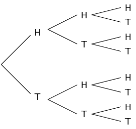
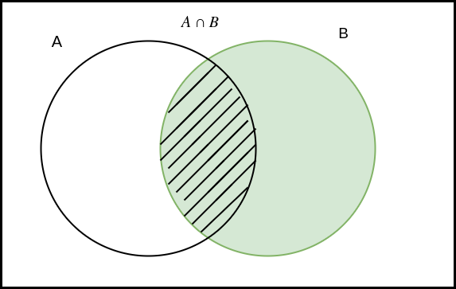
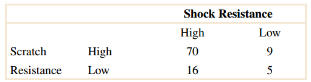
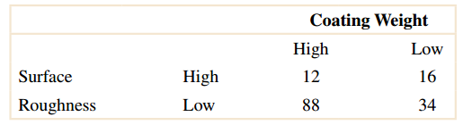

* TOC
{:toc}

## Counting Methods

Tree method


### With Replacement
The experement is restarts from initial state

number of combinations is  $n^k$


```python
from itertools import product as prod
S = {'Red', 'Green', 'Blue'}
n = 2 # Grouping in pairs Order matters
possible_outcomes = list(prod(S, repeat=n))
print("Number of ways : ", len(possible_outcomes))
possible_outcomes
```

    Number of ways :  9


    [('Green', 'Green'),
     ('Green', 'Blue'),
     ('Green', 'Red'),
     ('Blue', 'Green'),
     ('Blue', 'Blue'),
     ('Blue', 'Red'),
     ('Red', 'Green'),
     ('Red', 'Blue'),
     ('Red', 'Red')]


### Without Replacement
* Permutations
* Combinations

#### Permutations
Finding possible  ways of ordering set members in a sequence and order matters

 $$^{n}P_{k} =\frac{n!}{(n-k)!}$$.


```python
from itertools import permutations
S = {'Red', 'Green', 'Blue'}
n = 2 # Grouping in pairs Order matters
possible_outcomes = list(permutations(S, 2))
print("Number of ways : 3!/(3-2)! =  ", len(possible_outcomes))
possible_outcomes
```

    Number of ways : 3!/(3-2)! =   6


    [('Green', 'Blue'),
     ('Green', 'Red'),
     ('Blue', 'Green'),
     ('Blue', 'Red'),
     ('Red', 'Green'),
     ('Red', 'Blue')]


#### Combinations
Finding possible  ways of ordering set members in a sequence and order doesn't matter

 $$^{n}C_{k} =\frac{n!}{k!(n-k)!}$$.


```python
from itertools import combinations
S = {'Red', 'Green', 'Blue'}
n = 2 # Grouping in pairs order doesn't matter
possible_outcomes = list(combinations(S, 2))
print("Number of ways : 3!/(2!*(3-2)!) ", len(possible_outcomes))
possible_outcomes
```

    Number of ways : 3!/(2!*(3-2)!)  3


    [('Green', 'Blue'), ('Green', 'Red'), ('Blue', 'Red')]


## Example (With replacement)
An Urn contains 2 red balls, and 3 black balls. Balls are chosen in succession. The first ball is
returned to the urn before the second ball is chosen. Each ball is chosen randomly. 

* What is the probability of selecting two successive black balls ? 
* What is the probability of selecting three successive red balls ?
* What is the probability of selecting one black and two red balls ?


```python
S = {'RED', 'BLACK'}
probs = {'RED':2/5, 'BLACK':3/5 }
n = 2
possible_outcomes = list(prod(S, repeat=n))
print("Num outcomes : ", len(possible_outcomes))
possible_outcomes
```

    Num outcomes :  4


    [('RED', 'RED'), ('RED', 'BLACK'), ('BLACK', 'RED'), ('BLACK', 'BLACK')]


```python
probs_of_possible_outcomes = []
import numpy as np 
print("Event : Probability")
print('-'*30)
for event in possible_outcomes:
    event_probs = [probs[e] for e in event]
    prob = np.prod(event_probs)
    print("%s : %0.2f"%(event, prob))
    probs_of_possible_outcomes.append(prob)
```

    Event : Probability
    ------------------------------
    ('RED', 'RED') : 0.16
    ('RED', 'BLACK') : 0.24
    ('BLACK', 'RED') : 0.24
    ('BLACK', 'BLACK') : 0.36


```python
sum(probs_of_possible_outcomes)
```


    1.0


```python
two_successive_black = 0.6*0.6
three_successive_red = 0.4*0.4*0.4
one_black_two_red = 0.6*0.4*0.4*3
print(one_black_two_red)
```

    0.28800000000000003


## Example (Without Replacement and ordered)
Five balls numbered 1, 2, 3, 4, 5 are drawn from an urn without replacement. What is the probability
that they are drawn in the same order as their number?


```python
S = {a for a in range(1,6)}
S
```


    {1, 2, 3, 4, 5}


```python
import math
math.factorial(5)
```


    120


```python
all_possible_outcomes = list(permutations(S, 5))
print("Num of possible Outcomes 5P5 = 5!/(5-5)! : ", len(all_possible_outcomes))
prob = 1/len(all_possible_outcomes)
prob
```

    Num of possible Outcomes 5P5 = 5!/(5-5)! :  120


    0.008333333333333333


```python
all_possible_outcomes
```


    [(1, 2, 3, 4, 5),
     (1, 2, 3, 5, 4),
     (1, 2, 4, 3, 5),
     ...............,
     ...............,
     ...............,
     (5, 4, 2, 3, 1),
     (5, 4, 3, 1, 2),
     (5, 4, 3, 2, 1)]


## EXample (Without replacement and  not ordered)
How many subsets of size 3 can be made from {A, B, C, D}?

**Correction:**
{A, B, C, D, E} => {A, B, C, D}


```python
S = {'A', 'B', 'C', 'D'}
all_outcomes = list(combinations(S, 3))
print("Number of sets 4C3 = 4!/(3!*(4-3)!): ", len(all_outcomes))
all_outcomes
```

    Number of sets 4C3 = 4!/(3!*(4-3)!):  4


    [('C', 'A', 'D'), ('C', 'A', 'B'), ('C', 'D', 'B'), ('A', 'D', 'B')]


## Conditional Probability 

* Additional Information (Prior knowledge)
* Relative probabilities

$$P(A|B) = \frac{P(A\cap B)}{P(B)}$$




## Exercise 2-99

Disks of polycarbonate plastic from a supplier are
analyzed for scratch and shock resistance. The results from 100
disks are summarized as follows:



Let A denote the event that a disk has high shock resistance,
and let B denote the event that a disk has high scratch resistance. Determine the following probabilities:


(a) P(A)  

(b) P(B)

(c) 

$$P(A| B)$$ 

(d) 

$$P(B|A)$$

**Solution**


```python
space = {70, 9, 16, 5}
A = {70, 16}
B = {70, 9}
```


```python
def prob(X):
    return sum(X)/sum(space)

def cond_prob(X, Y):
    return prob(X & Y) / prob(Y)
```


```python
print("(a) \n===")
print("P(A) = ", prob(A))
```

    (a) 
    ===
    P(A) =  0.86


```python
# b
print("\n(b) \n===")
print("P(B) = ", prob(B))
```

    
    (b) 
    ===
    P(B) =  0.79


```python
# c 
print("(c) \n===")
print("P(A| B) = %0.3f"%cond_prob(A, B))
```

    (c) 
    ===
    P(A| B) = 0.886


```python
# D 
print("(D) \n===")
print("P(B| A) = %0.3f"%cond_prob(B, A))
```

    (D) 
    ===
    P(B| A) = 0.814


## Exercise 2-103
The following table summarizes the analysis of samples of galvanized steel for coating weight and surface roughness



(a) If the coating weight of a sample is high, what is the
probability that the surface roughness is high?

(b) If the surface roughness of a sample is high, what is the
probability that the coating weight is high?

(c) If the surface roughness of a sample is low, what is the
probability that the coating weight is low?


**Solution**

Let

**A:** coating weight is high

**B:** surface roughness is high


```python
space = {12, 16, 88, 34}
A = {12, 88}
B = {12, 16}
```

(a)

If the (coating weight of a sample is high) **A**, what is the probability that (the surface roughness is high) **B**?

We need to find :

$$P(B|A) = \frac{P(B\cap A)}{P(A)}$$


```python
print("P(B|A) = %0.3f"%cond_prob(B, A))
```

    P(B|A) = 0.120


(b)

If the (surface roughness of a sample is high) **B** , what is the probability that (the coating weight is high) **A**?

We need to find 

$$P(A|B)$$


```python
print("P(A|B) = %0.3f"%cond_prob(A, B))
```

    P(A|B) = 0.429


(c) 

If (the surface roughness of a sample is low) **B'**, what is the
probability that (the coating weight is low) **A'**?

We need to find 

$$P(A'|B')$$


```python
Ac = space - A
Bc = space - B
```


```python
print("P(A'|B') = %0.3f"%cond_prob(Ac, Bc))
```

    P(A'|B') = 0.279


## Exercise 2-107
A lot of 100 semiconductor chips contains 20 that
are defective. Two are selected randomly, without replacement,
from the lot.

(a) What is the probability that the first one selected is
defective?

(b) What is the probability that the second one selected is
defective given that the first one was defective?

(c) What is the probability that both are defective?

(d) How does the answer to part (b) change if chips selected
were replaced prior to the next selection?

**Solution**

let Di denotes the selected chip is defective for selection #i where i = 1, 2, 3

(a)


```python
space = {20, 80}
D1 = {20}
```


```python
# First Trial 
PD1 = prob(D1)
print("P(D1) = ", PD1)
```

    P(D1) =  0.2


(b)

Given that first selected chip was defective (No replacement) the space will change {19, 80}

as defective parts will decrease by one


```python
space = {19, 80}
D2 = {19}
PD2_giv_D1 = prob(D2)
print("P(D2|D1) = ", PD2_giv_D1)
```

    P(D2|D1) =  0.1919191919191919


(c)

$$P(D_1, D_2) \rightarrow P(D_1 \cap D_2) = P(D_1 | D_2) \times P(D2) =  P(D_2 | D_1) \times P(D_1)$$

So 

$$P(D_1, D_2) =  P(D_2 | D_1) \times P(D_1)$$


```python
P_D1_and_D2 = PD2_giv_D1 * PD1
print("P(D1 , D2) = ", P_D1_and_D2)
```

    P(D1 , D2) =  0.03838383838383838


(d)

If replacement exists so space will not change 


```python
space = {20, 80}
D2 = {20}
print("P(D2|D1) = ", prob(D2))
```

    P(D2|D1) =  0.2

