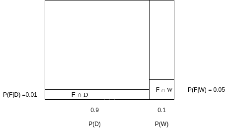
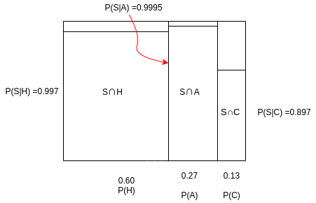
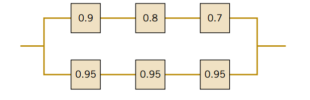
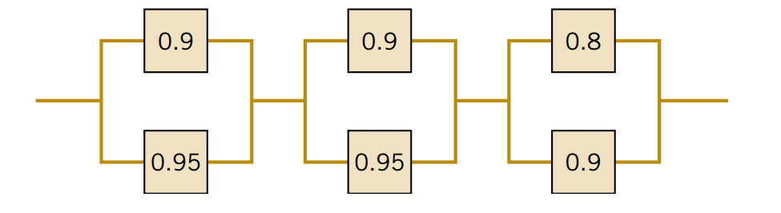

* TOC
{:toc}

## Conditional Probability 


$$P(A|B) = \frac{P(A\cap B)}{P(B)}$$


## Multiplication Rule, Total Probability Rule, Independence and Bayes Rule

### Multiplication Rule

From conditional probability rule 

$$P(A|B) = \frac{P(A\cap B)}{P(B)}$$

$$P(B|A) = \frac{P(B\cap A)}{P(A)}$$

So
$$P(A\cap B) = P(A|B)P(B)  $$

$$P(B\cap A) = P(B| A)P(A)$$

But $$P(A\cap B) = P(B\cap A)$$

$$P(A\cap B) = P(A|B)P(B) = P(B| A)P(A)$$

### Total probability Rule


For any event B

$$ B = (B \cap A) \cup (B \cap A')$$ 

and $A$ and  $A'$ are mutually exclusive 

So 

$$P(B) = P(B\cap A) + P(B\cap A')$$

and from multiplication rule 

$$P(B) = P(B| A)P(A) +  P(B| A')P(A') $$

In general If we have multiple mutually exclusive events $E_1, E_2, ... , E_k$

$$P(B) = P(B \cap E_1) + P(B \cap  E_2) +  ... + P(B \cap E_k)$$
$$P(B) = P(B|E_1)P(E_1) + P(B | E_2)P(E_2) +  ... + P(B| E_k)P(E_k) $$


### Independence

For Two events $A$ and $B$ they are independent If

$$P(A|B) = P(A)$$
$$P(B|A) = P(B)$$
$$P(A\cap B) = P(A)\times P(B)$$

**Note**

Independence does not mean they are mutually exclusive as for two mutually exclusive events $A$ and $B$, $P(A \cap B) = 0$

### Bayes Rule 

From conditional probability rule

$$P(A|B) = \frac{P(A\cap B)}{P(B)}$$

Using **multiplication rule**

$$P(A\cap B) = P(B|A)P(A)$$

So 

$$P(A|B) = \frac{ P(B|A)P(A) }{P(B)}$$

**Note**

From total probability rule 

$$P(B)$$

 can be calculated from 
 
 $$P(B) = P(B|A)P(A)+ P(B|A')P(A')$$


## Exercise 2-121

Suppose that 
$$P(A|B) =  0.4$$ 
and 
$$P(B)=0.5$$
 Determine the following:

(a) 
$$P(A\cap B)$$

(b)
$$P(A' \cap B)$$

**Solution**

(a) 

$$P(A \cap B) = P(A|B) P(B)$$ 


```python
P_A_given_B = 0.4 
P_B = 0.5
P_A_intersect_B = P_A_given_B * P_B
print("P(A ∩ B) = ", P_A_intersect_B)
```

    P(A ∩ B) =  0.2


(b) 

$$P(A' \cap B) = P(A'|B) P(B) $$ 

and

$$P(A'|B) = 1 - P(A|B)$$

So
$$P(A' \cap B) = (1-P(A|B))P(B) $$ 


```python
P_Ac_given_B = (1-P_A_given_B)*P_B
print("P(A' ∩ B) = ", P_Ac_given_B)
```

    P(A' ∩ B) =  0.3


**Another method**

from total probability rule 

$$P(B) = P(A \cap B) + P(A' \cap B)$$ 

Where $A$ and $A'$ are mutually exclusive

So 

$$P(A' \cap B) = P(B) - P(A \cap B)$$


```python
P_Ac_given_B = P_B - P_A_intersect_B
print("P(A' ∩ B) = ", P_Ac_given_B)
```

    P(A' ∩ B) =  0.3


## Exercise 2-123

The probability is 1% that an electrical connector
that is kept dry fails during the warranty period of a portable
computer. If the connector is ever wet, the probability of a failure during the warranty period is 5%. If 90% of the connectors
are kept dry and 10% are wet, what proportion of connectors
fail during the warranty period?

**Solution**

Let F denote connector failure

Let D denote dry connector

Let W denote wet connector




$$P(F) = P(F \cap D) + P(F \cap W)$$

Probability of intersection is the area of the rectangle. 

This satisfy the total probability rule 

$$P(F) = P(F|D)P(D) + P(F|W)P(W)$$


```python
P_F = 0.01*0.9 + 0.05*0.1
print("P(F) =%0.3f" %P_F)
```

    P(F) =0.014


## Exercise

A new method to detect defects in Aluminum sheets is being tested. This new method of ultrasound
wave analysis is important because, if adopted, it could be used to detect three different defects
holes, air bubbles, and contaminants instead of having to use a single test for each defect. The
makers of the test claim that it can detect holes with 99.7% accuracy, air bubbles with 99.95%
accuracy, and contaminants with 89.7% accuracy. If a defect is not present, the test does not signal.
Samples are prepared for the calibration of the test and 60% of them are defected with holes, 27%
with air bubbles, and 13% with different contaminants.
A test sample is selected randomly, if the test signals, what is the probability that contaminants are
present?

**Solution**



$$P(C|S) = \frac{P(S\cap C)}{P(S)}$$

$$P(C|S) = \frac{P(S\cap C)}{P(S \cap H)+P(S \cap A)+P(S \cap C)}$$


```python
PC_given_S = (0.897*0.13)/((0.897*0.13)+(0.9995*0.27)+(0.997*0.6))
print("𝑃(𝐶|𝑆) = %0.3f"%PC_given_S)
```

    𝑃(𝐶|𝑆) = 0.118


## Exercise 2-146
Disks of polycarbonate plastic from a supplier are
analyzed for scratch and shock resistance. The results from 100
disks are summarized as follows

|||Shock| Resistance|
|--|----|----|----|
|||High|Low|
|**Scratch**|High|70|9|
|**Resistance**|Low|16|5|


Let A denote the event that a disk has high shock resistance,
and let B denote the event that a disk has high scratch resistance. Are events A and B independent?


```python
space = {70, 9, 16, 5}
A = {70, 16}
B = {70, 9}
```


```python
def prob(X):
    return sum(X)/sum(space)

def are_independent(X, Y):
    return prob(X & Y) == prob(X)*prob(Y)
```


```python
print("A and B are independent ? ", "Yes" if are_independent(A, B) else "No")
```

    A and B are independent ?  No


```python
0.7 == (0.86*0.79)
```


    False


## Exercise 2-150

In a test of a printed circuit board using a random
test pattern, an array of 10 bits is equally likely to be 0 or 1.
Assume the bits are independent.

(a) What is the probability that all bits are 1s?

(b) What is the probability that all bits are 0s?

(c) What is the probability that exactly 5 bits are 1s and 5 bits
are 0s?

**Solution**

Independent events


```python
a = 0.5**10
b = 0.5**10
print("(a) %0.5f"%a)
print("(b) %0.5f"%b)
```

    (a) 0.00098
    (b) 0.00098


(c) 

This is a **Binomial Random Variable** (Next Chapter) 

$$P(k) = {n \choose k } p^k (1-p)^{(n-k)}$$


```python
from scipy.special import comb
n, k, p = 10, 5, 0.5
c = comb(n, k) * (p**k) * ((1-p)**(n-k))
print("(b) %0.5f"%c)
```

    (b) 0.24609


## Exercise 2-156

The following circuit operates if and only if there is
a path of functional devices from left to right. The probability
that each device functions is as shown. Assume that the probability that a device is functional does not depend on whether
or not other devices are functional. What is the probability that
the circuit operates?



**Solution**

Lets denote devices Dij where i is the row and j is the column

O denote circuit will operate

$$O = (D_{11} \cap D_{12} \cap D_{13}) \cup (D_{21} \cap D_{22} \cap D_{23} )$$
Let 

$$E_1 = D_{11} \cap D_{12} \cap D_{13}$$ 

$$E_2 = D_{21} \cap D_{22} \cap D_{23}$$ 

So

$$P(O) = P(E_1) + P(E_2) - P(E_1 \cap E_2)$$

They are **Independent**


```python
PE1 = 0.9*0.8*0.7
PE2 = 0.95**3
PO = PE1+PE2 - PE1*PE2
PO
```


    0.9292579999999998


**Another Solution**

$$P(O) = P(E_1 \cup E_2) = 1 -  P(E_1 \cup E_2)' = 1 -  P(E_1' \cap E_2') = 1 -  P(E_1')P(E_2')  $$


```python
PE1_c = 1-PE1
PE2_c = 1-PE2
PO = 1-PE1_c*PE2_c
PO
```


    0.9292579999999999


```python
1-PE1
```


    0.496


```python
PE1_c = 0.1+0.2+0.3-0.1*0.2-0.1*0.3-0.2*0.3+0.1*0.2*0.3
PE1_c
```


    0.49600000000000005


## Ex 2-157

Independent devices.

What is the probability that the circuit
operates?


