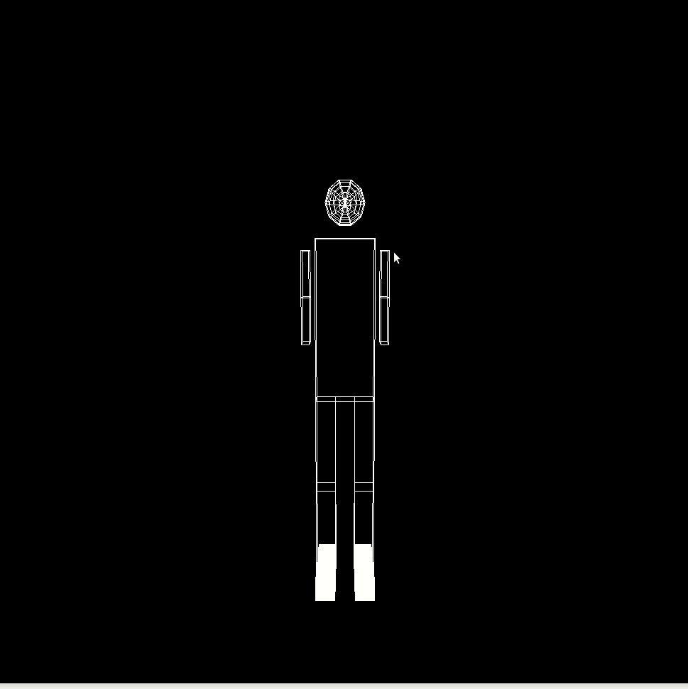

## Objectives

* Raising modeling transformation level. 
* Modeling a 3D object.
* Apply transformations to move the camera around,up,beneath and through the objects the model.
* simulation for full body joints movement.
* Report your results and comments.

## Deadline

Deadline for online submission will be  on  **Thurusday 6/5/2021 11:59 PM**

## Joining to Assignment Repository

This is an individual assignment 

1. Go to the [Assignment Page](https://classroom.github.com/a/AHdki-Bt).
2. Accept the assignment.
3. Wait till your repository created.
4. Open the link and Clone repository.
5. you will find a starter code for most of camera movements functions and you need to implement the logic.

## Instructions

1. use the robotic arm dra in assignment 1
2. the robotic arm should be complete.
3. draw a whole body with cubes and sphere for the head
4. implement the type of movements in the next gif



5. Set up camera to move around the body
6. the body joints movements from assignment 2 should be maintained.
7. using the mouse navigation for camera vertical rotations.
8. using the right arrow and left arrow keyboard keys to 
9. using the up arrow and down arrow provide rotation around horizontal axis.


## Submitting

```terminal
$ git commit -a -m "solved all problems!"
$ git push origin master
```

## Helper

1. Mouse function : [here](https://github.com/sbme-tutorials/SBE306-Computer-Graphics-Tutorials/blob/master/Tutorial-02/arm.c)