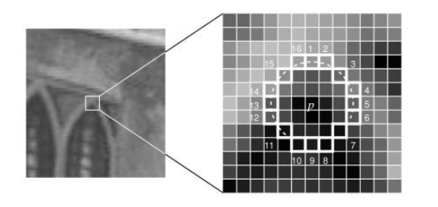
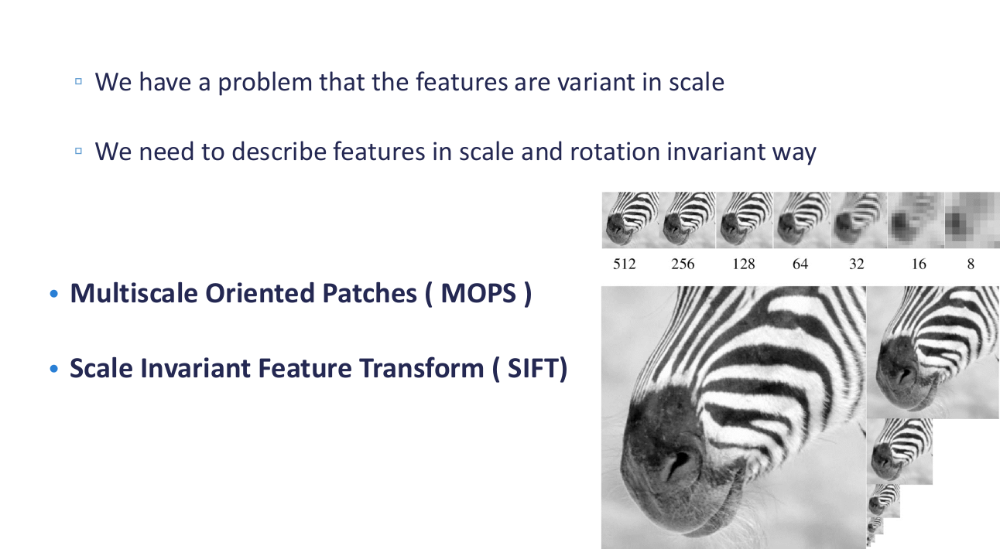

<textarea id="source">


class: top, left
## Corner Detection

By: Asem Alaa 
Tough By: Ayman Anwar

---

class: top, left
## Feature Detection

.center[]

---

.center[]

---

.center[]

---
class: top, left

### Challenges

* .red[Patch (image) matching]
--
  * .green[Distinctive features]
--
* .red[Geometric transformations (translation, rotation, scale)]
--
  * .green[Robust and efficient]
--
* .red[Photometric (brightness, exposure)]
--
  * .green[Many preprocessing options can be applied]


---
class: top, left
## Harris operator: corner detector


.center[]
--

---
## Compute the .red[principal] vectors of variation at location `p` 

.center[]

---
## Harris operator
### Step 1: image smoothing (optional)

--
$$ L(p,\sigma ) = \[I * G_\sigma \](p) $$

```python
 signal.convolve2d(img, gaussian_kernel(7,1.0) ,'same')
```

.center[]

---
## Harris operator
### Step 2: compute $I_x$ and $I_y$

Many options to compute the $I_x$ and $I_y$ exist:

1. First order difference.
2. Prewitt kernel
3. Sobel kernel

```python
Ix = signal.convolve2d( img , sobel_h ,'same')
Iy = signal.convolve2d( img , sobel_v ,'same')
```

.center[ ]

---
## Harris operator
### Step3: construct the Hessian (Hesh'n) matrix $M$

We will construct the Hessian matrix so we are able to compute the principal vectors of variation.

--
$$ M(p) = 
\begin{bmatrix}
I_x^2       & I_xI_y \\\
I_xI_y       & I_y^2
\end{bmatrix}
$$

--
```python
Ixx =  np.multiply( Ix, Ix) 
Iyy =  np.multiply( Iy, Iy)
Ixy =  np.multiply( Ix, Iy)
```

---
## Harris operator
### Step3 (Alternative): construct the Hessian (Hesh'n) matrix $M$ .red[over a window]

* If we need more robust detection
--
* Compute $M$ over a window (e.g $3 \times 3$)
--
* Now can detect larger corner that lives inside a window of pixels, instead of a single pixel.

--
$$
\hat{M}(p) = \sum_{i,j}  w(i,j)
\begin{bmatrix}
I_x^2       & I_xI_y \\\
I_xI_y       & I_y^2
\end{bmatrix}
$$

--
$$
\hat{M}(p) =
\begin{bmatrix}
\sum w(i,j) I_x^2(i,j)       & \sum  w(i,j) I_xI_y(i,j) \\\
\sum  w(i,j) I_xI_y(i,j)       & \sum w(i,j) I_y^2(i,j)
\end{bmatrix} 
$$

---
## Harris operator
### Step3 (Alternative): construct the Hessian (Hesh'n) matrix $M$ .red[over a window]

$$
\hat{M}(p) =
\begin{bmatrix}
\hat{I_x^2}       & \hat{I_xI_y} \\\
\hat{I_xI_y}       & \hat{I_y^2}
\end{bmatrix}
$$

--
```python
Ixx =  np.multiply( Ix, Ix) 
Iyy =  np.multiply( Iy, Iy)
Ixy =  np.multiply( Ix, Iy)

Ixx_hat = signal.convolve2d( Ixx , box_filter(3) ,'same') 
Iyy_hat = signal.convolve2d( Iyy , box_filter(3) ,'same') 
Ixy_hat = signal.convolve2d( Ixy , box_filter(3) ,'same') 
```


---
## Harris operator
### Step 4: compute $\lambda_1$ and $\lambda_2$ of $\hat{M}$

* Hessian matrix


* Eigen vectors and Eigen values
  * values (amount of variation)
  * vector (variation direction)

.center[]

---

.center[]


---
## Harris operator
### Step 4: compute $\lambda_1$ and $\lambda_2$ of $\hat{M}$

--
$$|H - \lambda I | = 0$$

---
## Harris operator
### Interpretation of $\lambda_1$ and $\lambda_2$

.center[]

---
## Harris operator
### Step 5: evaluate corners using $R$ as a measure

--
$$R = (\lambda_1 \times \lambda_2) - k (\lambda_1 + \lambda_2)$$


---
## Harris operator
### Step 4 (Alternative): evaluate $R$ directly without $\lambda_1$ and $\lambda_2$

#### Indirect solution

--
$$det(M) = \lambda_1 \times \lambda_2$$

--
$$trace(M) = \lambda_1 + \lambda_2 $$

--
##### Instead of calculating $\lambda_1, \lambda_2$

--
* $R = det(\hat{M}) - k * trace(\hat{M})$
--
* Trace is sum of diagonal elements 

---
## Harris operator
### Step 4 (Alternative): evaluate $R$ directly without $\lambda_1$ and $\lambda_2$

$$
\hat{M}(p) =
\begin{bmatrix}
\hat{I_x^2}       & \hat{I_xI_y} \\\
\hat{I_xI_y}       & \hat{I_y^2}
\end{bmatrix}
$$

$$R = det(\hat{M}) - k * trace(\hat{M})$$


```python
K = 0.05

detM = np.multiply(Ixx_hat,Iyy_hat) - np.multiply(Ixy_hat,Ixy_hat) 
trM = Ixx_hat + Iyy_hat
R = detM - K * trM 
```

---
## Harris operator
### Finally

```python
corners = ???
```

Select large values of $R$, using whatever thresholding heuristic in mind.


#### Thresholding options:
- constant absolute value 
  - (e.g `corners = np.abs(R) > 2.5`)
--
- relative to maximum value 
  - (e.g `corners =  np.abs(R) > 0.2 * np.max(R)`)
--
- relative to quantile value 
  - (e.g `corners =  np.abs(R) > np.quantile(np.abs(R),0.9)`)


```python
corners = np.abs(R) >  np.quantile( np.abs(R),0.999)
```
---
## Harris operator
### Results

--
.center[ ]


---

calss: top, left
## FAST Corner Detector
* Features from Accelerated Segment Test (FAST)
* Real-time applications.


---
## FAST Corner Detector
* Basic Algorithm

```python
1. Select Pixel p with intensity $$I_p$$ 
2. Select Threshold t
3. Consider circle with 16 pixels.
4. Calculate absolute difference $$I_p - I_i$$ and i =1 to 16
5. P is a corner if n points have absolute difference > t and n >= 6
6. Suppress weak corners (None-Max suppression)
```

--
* High Speed Test 

```python
4. Calculate absolute difference $$I_p - I_i$$ Considering i =1, 9, 5, 13 only.
5. P is a corner if n points have absolute difference > t and n >= 3
6. Suppress weak corners (None-Max suppression)
```
--
* None-Max suppression

```python
For successive corners.
1. For each corner point p
1. Compute score V which is sum of absolute difference between point p and 16 circle points.
2. Suppress if not local maximum. 
```

---
## Feature Description

--
.center[]

---
# Thanks    
    
</textarea>
